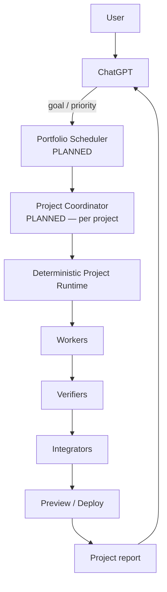
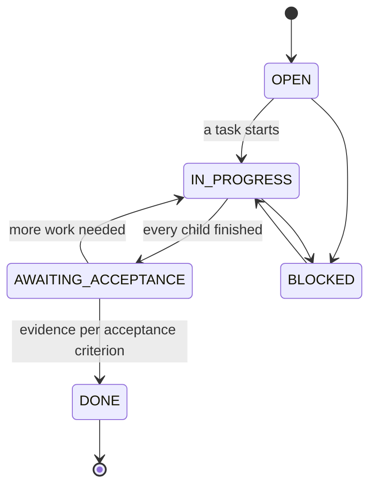

# Terminal MCP — Orchestration Architecture

> Status: **Orchestration V1 in progress.** This document describes what the
> code actually does today, and marks planned pieces explicitly as `PLANNED`.
> Anything not marked `PLANNED` is implemented, tested and deployed.

## 1. The problem this solves

ChatGPT could drive Terminal MCP only by micromanaging: asking which session
was free, pressing Enter for each prompt, checking whether a worker had
picked up a task, remembering who was editing which file, manually moving a
Linux task to a Windows box for verification, and polling ten tmux sessions.

That is coordination overhead, and it is the thing to eliminate. The split:

| Deterministic code decides | An LLM decides |
| --- | --- |
| assignment, leases, locks, queues, capability matching, retry policy, event ordering, state transitions, verification routing, reporting | requirement interpretation, decomposition, dependency reasoning, semantic conflict, judging evidence |

If a rule can be written down, it is code. An LLM is never used for something
deterministic code can do correctly — that is not a cost decision, it is a
correctness one: a gate that reasons is a gate that can be talked out of its
answer.

## 2. Layers



**No global LLM coordinator holds every project's context.** Each project's
coordinator gets a bounded context package for that project only. Cross-project
resource decisions are made by a deterministic scheduler, not by reasoning.

## 3. Data model — what is authoritative

The runtime is the source of truth. An LLM context window never is.

| Concept | Store | Table |
| --- | --- | --- |
| Project identity | `project_identity.py` | derived: `git:host/org/repo` |
| Backlog (intent) | `backlog.db` | `backlog_projects`, `backlog_items` |
| **Outcome** (deliverable) | `queue.db` | `outcomes` |
| Task (executable unit) | `queue.db` | `queue_tasks` |
| Task lease | `queue.db` | columns on `queue_tasks` |
| Verify job | `queue.db` | `verify_jobs` |
| Resource lock | `leases.db` | `resource_locks` (+ `resource_lock_overrides`) |
| Event log | `events.db` | `events`, `event_cursors` |
| Node capability (**probed**) | `nodes.db` | `nodes.capabilities` |
| Worker capability (**declared**) | `pm_store.db` | `capability_profiles` |
| Merge queue | `integration.db` | `integration_handoffs`, `_batches` |
| Session lifecycle | `session_registry.db` | `session_records` |

Repo files (`.terminal-mcp/backlog.json`) are **projections**, never the
runtime source of truth. A repo file cannot be a lock or a lease: one project
lives in many checkouts on many machines.

## 4. The hierarchy, and the rule that shapes it

```
backlog item  →  OUTCOME  →  N tasks  →  verify → merge → preview
   intent        deliverable    work
```

Before Orchestration V1 this was two levels welded 1:1 — one backlog item
produced exactly one task, once (`ALREADY_DISPATCHED`). "This deliverable took
five tasks" was inexpressible, so "did the overview screen ship?" was
unanswerable while "12 tasks completed" was.

**An outcome is not done because its children are done.**

This is the most important rule in the system. Children completing means the
work someone *planned* finished; it says nothing about whether the thing a
user can see works. Every real project has the failure where five tasks pass,
tests are green, and the screen is still broken — because nobody wrote the
task that would have caught it.

So the rollup **structurally cannot reach `DONE`**:



`AWAITING_ACCEPTANCE` is named for exactly what it is: the state a naive
implementation would have called done.

### The three evidence gates

Deliberately increasing in strictness, because each guards a larger claim:

| Gate | Requires |
| --- | --- |
| `queue_store.mark_completed_with_evidence` | non-empty evidence |
| `verify_queue.complete` | more than a self-report, not self-contradicted (`exit_code != 0`, `passed: false`, `tests_failed > 0` all refuse) |
| `outcomes.complete` | evidence **named against each acceptance criterion** |

The outcome gate reuses `verify_queue.evidence_verdict` rather than inventing
a fourth notion of what evidence is.

## 5. Task lifecycle

14 statuses, every edge validated centrally in `VALID_TRANSITIONS`; an invalid
transition raises rather than being coerced.

```
QUEUED → PRECHECK → READY → DISPATCHING → RUNNING → VERIFYING → COMPLETED
                                    ↘ DISPATCH_UNCERTAIN ↗
        ↘ BLOCKED / FAILED / WAITING_SESSION / PAUSED / SKIPPED / CANCELLED
```

- **Claiming is atomic**: `BEGIN IMMEDIATE` takes the write lock *before* the
  read, closing a real TOCTOU race between two concurrent engine workers.
- **Every post-claim verb requires the current `claim_token`**, so a holder
  whose lease expired cannot act on the new holder's work.
- **Dependencies are fail-closed and cross-lane**: a missing dependency id
  counts as unmet. Because that is right for "not done yet" and catastrophic
  for "can never be satisfied", cycles and unknown ids are refused at
  **creation** (`INVALID_DEPENDENCY`) — the only place they can still be
  reported to whoever caused them. `dependency_deadlocks()` diagnoses rows
  already broken.

## 6. Verification is claimable work, not a state of the same session

A verify job is a **satellite** of a task, so P0.5 added **zero** task
statuses and zero transition edges — asserted structurally by a test.

- Routing is **AND** over *reported* facts only: probed tools plus
  `platform`/`session_backend`/`shell_capabilities`. Nothing is inferred — a
  Windows box is not assumed to build WebView2.
- `require_independent` refuses a job whose implementer is the claimant.
- No capable verifier is a **visible hold** with a routability reason, never a
  silent pass and never a dropped task.
- **Known limitation:** `macos` is not routable — the node agent has no Darwin
  branch, so the MacBook reports `platform=linux`.

## 7. Events

`events.db` is a durable, per-project-ordered, idempotent log.

Until Orchestration V1 the bus *defined* exactly the vocabulary the queue and
verify queue produce — `TASK_CREATED`, `VERIFY_PENDING`, `WORKER_DONE` — and
**none of them ever called `publish()`**. Six subsystems, zero coupling, one
event in production.

Now:

```
TASK_CREATED → TASK_STARTED → WORKER_DONE → VERIFY_PENDING
             → VERIFY_CLAIMED → TASK_COMPLETED → VERIFY_PASS
```

- Producers are **optional sinks** on the stores; the stores know nothing
  about event types or scoping, so the mapping (policy, and it will change)
  lives in `event_wiring.py`.
- The hook sits on `_record_event_locked`, the single chokepoint all 14 call
  sites already use, so coverage is complete by construction.
- **Delivery is at-least-once, deliberately.** The bus is a different database
  from the queue, so there is no cross-store transaction. Publishing *inside*
  the queue transaction would allow an event describing a transition that then
  rolled back — strictly worse. Publishing after commit is covered by
  idempotency: every event is keyed on the `queue_events` row id, an
  autoincrement PK and therefore already the perfect natural key.
- A rollback **discards** pending events; an event describing a rolled-back
  transition would be a lie. A sink that raises is swallowed — a publish
  glitch must never un-commit real state.

### Two consumption models, for two different jobs

| | `claim` / `ack` | cursor (`read_since` / `commit_cursor`) |
| --- | --- | --- |
| For | **work** — one event, one worker | **observation** — many readers |
| Effect | consumes; ack destroys it for everyone | non-destructive |
| Position | lease + attempt budget | durable per-consumer high-water mark |

Reading does **not** advance a cursor — a consumer that crashes mid-handling
re-reads rather than silently skipping — and `commit_cursor` is **monotonic**,
so a replayed commit cannot rewind a consumer into reprocessing.

`causation_id` says *this happened because of that*, distinct from
`correlation_id` which merely groups. Without it, a coordinator that reacts to
events by emitting events makes a chain nobody can reconstruct — which is how
a feedback loop hides.

**Dead-letter:** `MAX_ATTEMPTS` used to be a claim *filter* only, so an event
that burned its budget stayed `PENDING` forever — never `FAILED`, absent from
`stats()`, invisible everywhere. It now transitions to `FAILED` with a reason.

## 8. Workers, roles, capabilities

`WorkerRegistry` is a **view**, not a store — everything is already persisted
in three places that each own their piece.

Five roles: `WORKER`, `VERIFIER`, `INTEGRATOR`, `DEPLOYER`, `COORDINATOR`. A
worker may hold several. Unknown roles are dropped, not raised: role data is
operator-typed, and one typo should narrow eligibility, not break the listing.

**Declared ≠ detected, and they are never merged.** `capability_probe.py`
exists because a node whose operator *wrote* `claude:` into config but never
installed the CLI was still scheduled as claude-capable. Node capabilities are
probed (`shutil.which`, never executing the tool); session capabilities are
declared by an operator. `can(..., trust_declared=False)` matches only what
was measured.

Staleness is **reported, not guessed**: capabilities carry no `verified_at`,
so `capability_age_seconds` derives from heartbeat age rather than treating an
online node with a three-month-old probe as freshly measured.

## 9. Resource ownership

`ResourceLockStore` generalises the pane lease: same atomic check-and-set —
one `INSERT … ON CONFLICT … WHERE`, whose exact shape came from reproducing a
real race — parameterised by table.

- Project-scoped composite key, so `src/app.py` in two projects is two locks.
- `acquire_many` is **all-or-nothing under one write lock**, keys sorted: two
  agents each needing `{a, b}` cannot end up holding one apiece forever.
- **Advisory, not enforcement.** Nothing can physically stop an agent editing
  a file it did not lock. Claiming otherwise would be a false guarantee.
- **No waiter queue, deliberately** — a caller is told who holds the lock and
  decides for itself. Blocking inside a lock primitive is how a fleet deadlocks.
- `force_release` requires an actor and reason and **persists** them.

## 10. Safety invariants that must never regress

**Submit policy** — identical across MCP, dashboard, queue, coordinator,
supervisor, controller, Linux tmux and Windows ConPTY:

| Agent | Policy |
| --- | --- |
| Codex | inject once; **bounded** Enter retries with composer evidence; never resend the prompt |
| Claude | inject once; **at most one** initial Enter; **no** retry, **no** sweeper, **no** resend |
| Unknown | Claude-like single-submit |

Unconfirmed delivery is reported as `DELIVERY_UNKNOWN`/`STUCK`, never guessed
as success. No orchestration path may bypass this with a manual send-key.

**Autonomy stays gated.** Every autonomous loop is off or inert by default:
supervisor (0 watches), queue auto-dispatch (no lane opted in), integration
loop (off), recovery loop (off), event bus (no consumer). Wiring producers
onto the bus changed nothing about this — it only starts feeding the log.

**Never**: log a token or auth material, expose secrets in the dashboard,
bypass permissions, let project A mutate project B, or trust a stale heartbeat
indefinitely.

## 11. Recovery

Restart-safe today: durable `recovery_generation`/`recovery_attempts`,
exactly-once recovery via a TTL lock that self-frees on crash, sticky
`dispatch_idempotency_key` so a restart mid-dispatch cannot double-send, and
`reconcile_stale_claims` returning expired leases to `QUEUED`.

`PLANNED` — known gaps, all recorded in the backlog:
- The recovery loop is **off**, and `reconcile_node` has no cap: enabling it
  today would attempt ~386 spawns on the first cycle.
- `session_registry` has no `project_id` and no `task_id`, so recovery
  restores a session without its project or in-flight work.
- Verify-job lease reconciliation has no background driver.
- `mark_node_offline` has no production caller, so sessions on a dead node are
  never marked offline.

## 12. What is deliberately not built yet

| Piece | Status |
| --- | --- |
| Project Coordinator framework + provider | `PLANNED` — no LLM provider abstraction exists anywhere yet |
| Portfolio Scheduler | `PLANNED` — will compose over `pm_router`'s two-phase deterministic routing (hard constraints, then scoring with fairness), not replace it |
| Preview / deploy execution | `PLANNED` — `release_store` is **state-tracking only**: `DEPLOYED` and `VERIFIED_PROD` are assertions, not observations |
| Merge queue activation | `PLANNED` — built, 88 tests, 0 production rows. Blocked on a real defect: the integrator merges via `git checkout` in the **shared** repo path and would switch branches under a live working tree |
| Project-scoped knowledge | `PLANNED` — `session_knowledge` is session-keyed and matches project by substring over paths |

## 13. Reading order for a new contributor

1. `queue_store.py` — the state machine and lease. Everything else layers on it.
2. `coordinator.py` — the **deterministic dispatch safety gate**. Note it is
   *not* the Project Coordinator; it decides whether a task is safe to send.
3. `verify_queue.py` — how a satellite adds a stage without touching the task
   state machine.
4. `event_wiring.py` — how subsystems are connected without coupling them.
5. `outcomes.py` — the completion rule, and why it is a rule and not a rollup.
